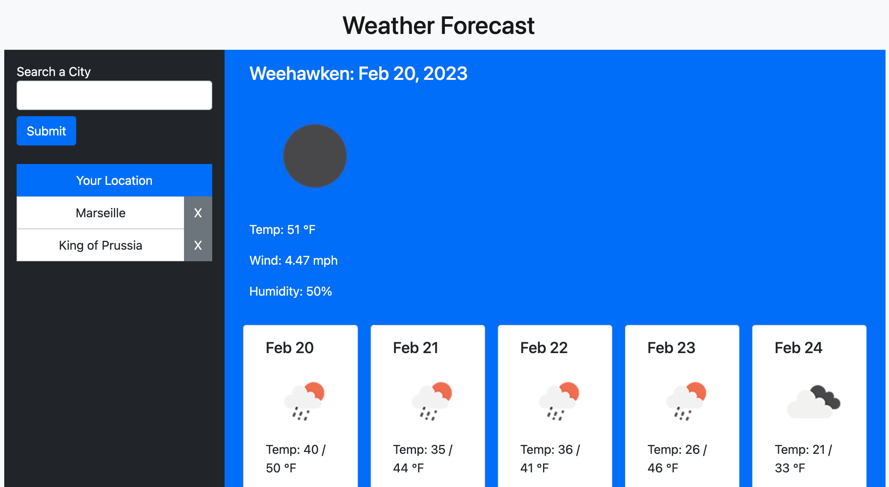

# weather-challenge

## Description

This Weather Forecast Application was created as part of the requirements for a Full Stack Development boot camp. Additionally, it is intended to allow users to look up the weather for any city and store the search history in local storage.

## Usage

Navigate to the deployed application with the following link:
https://keimdm.github.io/weather-challenge/

### Header/Home
The header contains a title for the application. On the initial load, the forecast display will be hidden, and the user will be shown a message that they should pick a location. If the geolocator browser API is allowed, the application will automatically load the current weather and five day forecast for the user's location, which can be accessed under the "Your Location" option in the city list.

### City Search Column
The city search column contains a search field where the user can enter the name of a city and press the "Submit" button to search. The application will then show the current weather and five day forecast for that city, and add the city to the list if it isn't already there. If the a city cannot be found that matches the search input, the search will be cleared and an error message displayed in the console.

Clicking on a previously searched city in the list will display the weather and five day forecast for that city. If the gray X is pressed, the city will be deleted from the list as well as local storage. If the deleted city was the one being displayed, the application will default back to the "Your Location" option (if that isn't available, it will prompt the user to allow it).

### Weather Column
The weather column contains the current conditions and five day forecast for the selected location. Displayed for each is an icon representation of the weather conditions, the temperature (broken out as a min and max for the forecast), the wind speed, and the humidity. The name of the selected location and the dates covered in the forecast are also displayed.

## Credits
This application uses the following third-party APIs and libraries:
JQuery: https://jquery.com/
JQuery UI: https://jqueryui.com/
Bootstrap: https://getbootstrap.com/
DayJS: https://day.js.org/
OpenWeather API: https://openweathermap.org/api